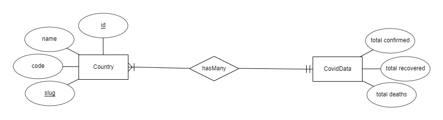

## About Laravel

Laravel is a web application framework with expressive, elegant syntax. We believe development must be an enjoyable and creative experience to be truly fulfilling. Laravel takes the pain out of development by easing common tasks used in many web projects, such as:

- [Simple, fast routing engine](https://laravel.com/docs/routing).
- [Powerful dependency injection container](https://laravel.com/docs/container).
- Multiple back-ends for [session](https://laravel.com/docs/session) and [cache](https://laravel.com/docs/cache) storage.
- Expressive, intuitive [database ORM](https://laravel.com/docs/eloquent).
- Database agnostic [schema migrations](https://laravel.com/docs/migrations).
- [Robust background job processing](https://laravel.com/docs/queues).
- [Real-time event broadcasting](https://laravel.com/docs/broadcasting).

Laravel is accessible, powerful, and provides tools required for large, robust applications.

## Learning Laravel

Laravel has the most extensive and thorough [documentation](https://laravel.com/docs) and video tutorial library of all modern web application frameworks, making it a breeze to get started with the framework.

If you don't feel like reading, [Laracasts](https://laracasts.com) can help. Laracasts contains over 1500 video tutorials on a range of topics including Laravel, modern PHP, unit testing, and JavaScript. Boost your skills by digging into our comprehensive video library.

## Laravel Sponsors

We would like to extend our thanks to the following sponsors for funding Laravel development. If you are interested in becoming a sponsor, please visit the Laravel [Patreon page](https://patreon.com/taylorotwell).

- **[Vehikl](https://vehikl.com/)**
- **[Tighten Co.](https://tighten.co)**
- **[Kirschbaum Development Group](https://kirschbaumdevelopment.com)**
- **[64 Robots](https://64robots.com)**
- **[Cubet Techno Labs](https://cubettech.com)**
- **[Cyber-Duck](https://cyber-duck.co.uk)**
- **[Many](https://www.many.co.uk)**
- **[Webdock, Fast VPS Hosting](https://www.webdock.io/en)**
- **[DevSquad](https://devsquad.com)**
- [UserInsights](https://userinsights.com)
- [Fragrantica](https://www.fragrantica.com)
- [SOFTonSOFA](https://softonsofa.com/)
- [User10](https://user10.com)
- [Soumettre.fr](https://soumettre.fr/)
- [CodeBrisk](https://codebrisk.com)
- [1Forge](https://1forge.com)
- [TECPRESSO](https://tecpresso.co.jp/)
- [Runtime Converter](http://runtimeconverter.com/)
- [WebL'Agence](https://weblagence.com/)
- [Invoice Ninja](https://www.invoiceninja.com)
- [iMi digital](https://www.imi-digital.de/)
- [Earthlink](https://www.earthlink.ro/)
- [Steadfast Collective](https://steadfastcollective.com/)
- [We Are The Robots Inc.](https://watr.mx/)
- [Understand.io](https://www.understand.io/)
- [Abdel Elrafa](https://abdelelrafa.com)
- [Hyper Host](https://hyper.host)
- [Appoly](https://www.appoly.co.uk)
- [OP.GG](https://op.gg)
- [云软科技](http://www.yunruan.ltd/)

## Contributing

Thank you for considering contributing to the Laravel framework! The contribution guide can be found in the [Laravel documentation](https://laravel.com/docs/contributions).

## Code of Conduct

In order to ensure that the Laravel community is welcoming to all, please review and abide by the [Code of Conduct](https://laravel.com/docs/contributions#code-of-conduct).

## Security Vulnerabilities

If you discover a security vulnerability within Laravel, please send an e-mail to Taylor Otwell via [taylor@laravel.com](mailto:taylor@laravel.com). All security vulnerabilities will be promptly addressed.

# Covid-19 Statistics System

## API Used (Data Source)

I have used the following API <a href="https://covid19api.com/">https://covid19api.com/</a>. It provides a good amount of different request handlers but it has showed some inconsistencyin showing the data for my requests.

I have used the following:
- <a href="https://api.covid19api.com/countries">https://api.covid19api.com/countries</a>
- <a href="https://api.covid19api.com/total/dayone/country/south-africa">https://api.covid19api.com/total/dayone/country/south-africa</a>
- <a href="https://api.covid19api.com/country/south-africa?from=2020-03-01T00:00:00Z&to=2020-04-01T00:00:00Z">https://api.covid19api.com/country/south-africa?from=2020-03-01T00:00:00Z&to=2020-04-01T00:00:00Z</a>

## Models

I have decided to go with two model one which held the country information and the other which will hold the daily cases of the corona virus with a foriegn key to the country table. 
The following diagram might help:

## Controllers

In this system, I have only one controller called 'CountryController'. It has the following methods:

#### changeCountryAPI($name)

This method should handle the AJAX requests from the front-end to update the data to a specified country.

###### Parameters:

- name: which is the country name

###### Return:

- JSON object that has the following information: total_cases, new_cases, total_recovered, new_recovered, total_deaths, new_deaths, active_cases, and new_active_cases. Or it returns "Error".

#### show()

This method should handle the request to display the page. It will calculate the global numbers and construct the view.

###### Parameters:

- void

###### Return:

- a View

#### updateAll()

This method is resposible to decide whether we should populate the tables if they are empty (populateTables method will be called) or fetch the latest data (updateData method will be called). It should be called periodically through a cron job in the server. I have initiated the Laravel part to run daily.

###### Parameters:

- void

###### Return:

- void

#### populateTables()

This method is responsible to fetch all the data from the API and store them in the Databse. This method will be called only if the countries table is empty.

###### Parameters:

- void

###### Return:

- void

#### updateData($countries)

This method is responsible to fetch the latest data from the API and store them in the database for each country.

###### Parameters:

- Collection of countries data stored in the database

###### Return:

- void

## View
## Diffulties faced
## Enhancement Opportunities
## License

The Laravel framework is open-sourced software licensed under the [MIT license](https://opensource.org/licenses/MIT).
